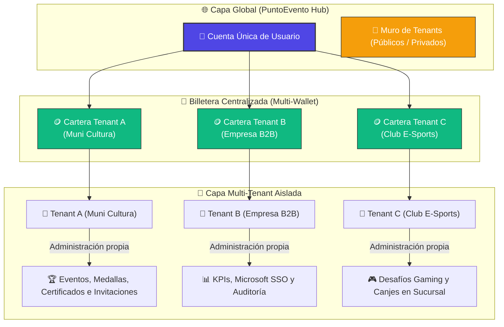
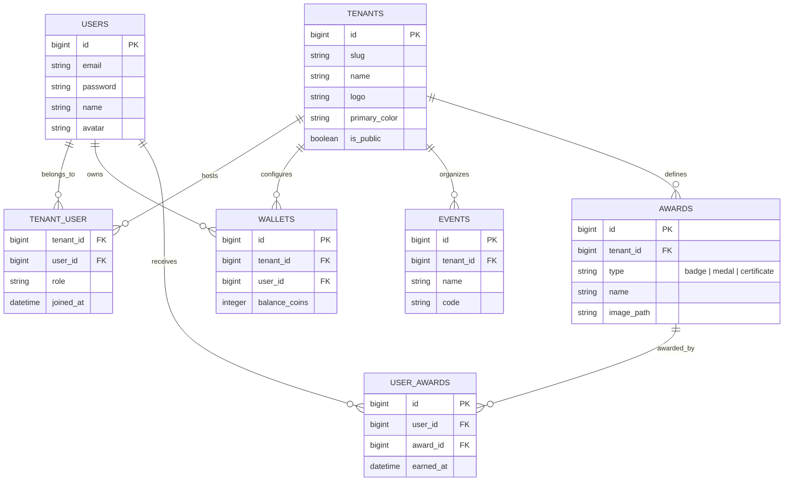

# 🚀 Visión de Futuro: El Ecosistema Multi-Tenant Global de PuntoEvento

## 1. Introducción y Concepto Core

La visión de futuro para **PuntoEvento** es evolucionar desde un software de evento único hacia una **red global multi-tenant centralizada**, funcionando de manera similar a un "CryptoMarket" de fidelización y gamificación social.

En este ecosistema global:
1.  **Identidad Única de Usuario (Global Passport)**: Un usuario se registra una sola vez en la plataforma global. Este perfil único le otorga un pasaporte digital que puede vincularse y unirse a múltiples organizaciones o clientes (**Tenants**).
2.  **Billetera Multi-Moneda (Multi-Tenant Wallet)**: Cada Tenant emite su propia moneda digital interna, exclusiva y no comercializable (no transferible entre usuarios ni entre Tenants). La billetera del usuario centraliza los saldos de cada organización a la que pertenece (ej. *“Tienes 450 Puntos Muni-Cultura, 2,000 Puntos Empresa-A y 3 Medallas del Club Deportivo”*).
3.  **Muro de Descubrimiento (Tenant Wall/Directory)**: Un escaparate público donde las personas pueden descubrir Tenants públicos a los que unirse directamente, o ingresar a Tenants privados exclusivamente mediante invitaciones o códigos de acceso empresarial corporativos.

---

## 2. Diagrama de la Arquitectura del Ecosistema

Este diagrama visualiza cómo la identidad del usuario unifica sus carteras, mientras los administradores de cada Tenant controlan de forma 100% aislada sus propias dinámicas, recompensas y monedas:

---

## 3. Modelo de Datos Conceptual (Relaciones de Base de Datos)

Para lograr esta arquitectura altamente flexible y escalable con un modelo único, se propone la siguiente estructura de datos relacional:

---

## 4. Los Pilares de la Experiencia Multi-Tenant

### A. Muro de Tenants (El Directorio del Ecosistema)
*   **Acceso Público (Descubrimiento)**: Entidades públicas como Municipalidades, ONGs o Universidades listan sus perfiles en el "Muro de Tenants" abierto. Cualquier usuario puede explorar el muro, ver las actividades culturales/recreativas vigentes y hacer clic en *"Unirse"* para generar automáticamente su billetera de puntos para esa organización.
*   **Acceso Privado (Invitación / SSO)**: Las corporaciones operan de manera invisible en el muro público. Solo se puede ingresar si se recibe un enlace de invitación único, un código QR administrativo o mediante validación directa de correo empresarial a través de Microsoft Single Sign-On (SSO).

### B. Módulos de Recompensas Avanzados
Cada Tenant, de forma independiente, activa y gestiona los módulos de recompensa que se adapten a sus objetivos:
1.  **Asistencias y Participación**: Marcaje instantáneo por lectura de QR administrado o geolocalización en eventos culturales, deportivos y corporativos.
2.  **Insignias y Medallas Gamificadas (Digital Badges)**: Logros coleccionables ilustrados para perfiles virtuales (ej. *"Medalla de Asistencia Perfecta"*, *"Insignia de Colaborador Proactivo"*).
3.  **Certificados Digitales con Validación Única (Blockchain/PDF)**: Generación automática de diplomas y certificados de participación con firma digital verificable por código QR para validar su autenticidad curricular.

---

## 5. Caso de Éxito de la Proyección: El Ecosistema Municipal

Imaginemos el impacto de PuntoEvento en la gestión pública local mediante un **Tenant Municipal**:

1.  **Activación de Actividades**: La municipalidad crea el evento *"Festival de Teatro de Otoño"*.
2.  **Participación**: Vecinos asisten a las obras de teatro gratuitas. En el ingreso, escanean el código QR en el stand cultural y reciben de inmediato **50 "Muni-Puntos"** y la **"Medalla de Fomento de las Artes"** en su pasaporte digital.
3.  **Diplomas**: Si un vecino asiste a 4 obras de teatro durante el ciclo, el sistema genera automáticamente un **Certificado Digital de Fomento Cultural** firmado por el Alcalde que se descarga como PDF verificable.
4.  **Canje Sostenible**: La municipalidad asocia puntos de canje con emprendedores locales. El vecino acude a la feria de emprendedores ("Sucursal de Canje") y utiliza sus Muni-Puntos para obtener descuentos en productos locales o entradas prioritarias para el próximo concierto municipal.
